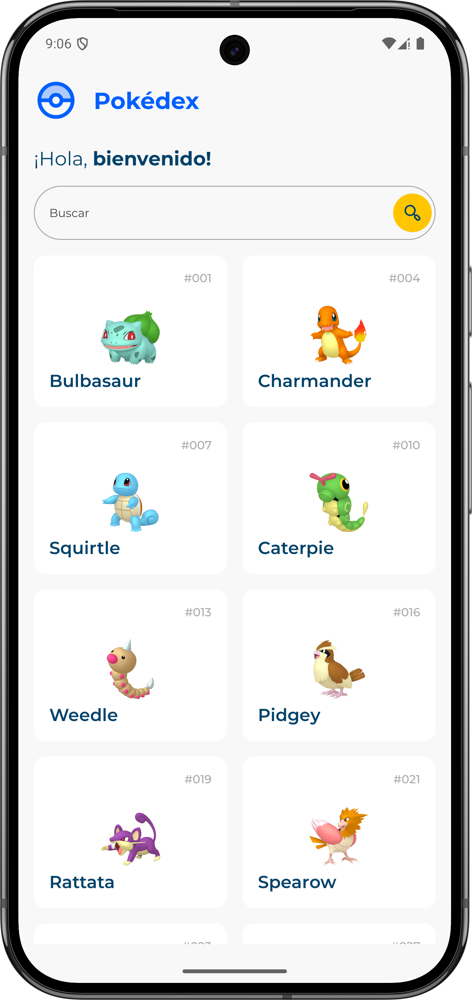
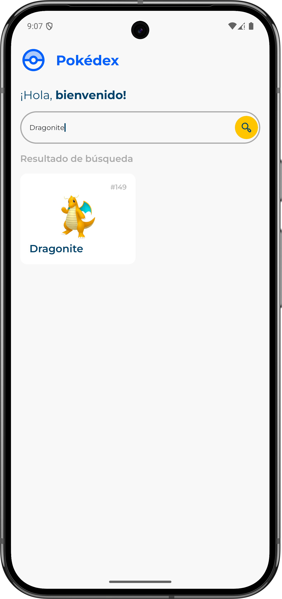
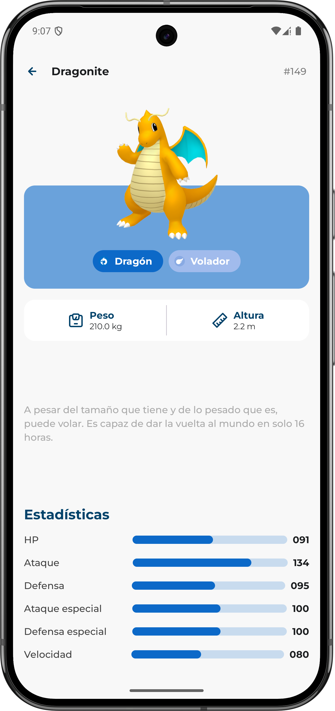

# PocketDex

Aplicación Android que muestra el listado de Pokémon de la primera generación, permite buscarlos por nombre o ID y consultar el detalle de cada uno, incluyendo tipos, estadísticas base y descripción. Los datos se obtienen desde la [PokéAPI](https://pokeapi.co/).

---

## Decisiones técnicas relevantes

### Arquitectura

Se adoptó **Clean Architecture** con separación en tres capas bien definidas:

- **Domain**: modelos de negocio, interfaces de repositorio y casos de uso. No tiene dependencias de Android ni de frameworks externos.
- **Data**: implementaciones de repositorio, mappers DTO → dominio y clientes de red.
- **UI**: ViewModels, estados, eventos y composables.

### Modularización

El proyecto está dividido en módulos de Gradle para separar responsabilidades y acelerar los tiempos de compilación:

| Módulo | Responsabilidad                                    |
|---|----------------------------------------------------|
| `:core:domain` | Modelos, repositorios e interfaces de casos de uso |
| `:core:network` | Cliente Retrofit, DTOs y manejo de errores de red  |
| `:core:data` | Implementaciones de repositorio y mappers          |
| `:core:ui` | Tema, componentes Compose compartidos              |
| `:feature:pokemon-list` | Pantalla con ViewModel de listado y búsqueda       |
| `:feature:pokemon-detail` | Pantalla con ViewModel de detalle del Pokémon      |
| `:app` | Punto de entrada, navegación y configuración de DI |

### Stack tecnológico

- **Kotlin** en su versión 2.3.20
- **Jetpack Compose** para la UI declarativa
- **Navigation Compose** con rutas tipadas (`@Serializable`) para la navegación entre pantallas
- **Retrofit 3 + kotlinx-serialization** para las llamadas a la red
- **Koin** para inyección de dependencias
- **Coil 3** para carga de imágenes remotas
- **Coroutines** para operaciones asíncronas

### Gestión de estado

Cada pantalla sigue el patrón **UiState / UiEvent**:

- `UiState`: data class inmutable que el ViewModel expone como `StateFlow`
- `UiEvent`: sealed interface con las acciones que puede disparar la UI
- La navegación se trata como un efecto de UI y se pasa como callback, sin involucrar al ViewModel

### API de Pokémon

- **Listado**: `GET /generation/1` — devuelve todos los Pokémon de la primera generación
- **Búsqueda y detalle**: `GET /pokemon/{id}` — datos del Pokémon (tipos, stats, habilidades, sprites)
- **Descripción**: `GET /pokemon-species/{id}` — entradas de texto de la Pokédex; se prioriza el idioma español (`es`) y se usa inglés (`en`) como fallback

---

## Instrucciones para compilar y ejecutar

### Requisitos previos

- **Android Studio Meerkat** (2024.3.1) o superior
- **JDK 11** o superior
- **Android SDK** con API level 24 o superior instalado
- Conexión a Internet (los datos se obtienen de la PokéAPI en tiempo real)

### Pasos

1. Clonar el repositorio:

```bash
git clone <url-del-repositorio>
cd PocketDex
```

2. Abrir el proyecto en Android Studio:
   - `File → Open` y seleccionar la carpeta raíz del proyecto

3. Esperar a que Gradle sincronice las dependencias automáticamente.

4. Conectar un dispositivo Android (API 24+) o iniciar un emulador.

5. Ejecutar la app:
   - Desde Android Studio: botón **Run ▶** o `Shift + F10`

### Compilar un APK debug

```bash
./gradlew :app:assembleDebug
```

El APK generado se encontrará en `app/build/outputs/apk/debug/app-debug.apk`.

## Capturas de pantalla

<table>
  <thead>
    <tr>
      <th>Pantalla principal</th>
      <th>Pantalla de busqueda</th>
      <th>Notificaciones</th>
    </tr>
  </thead>
  <tbody>
    <tr>
      <td>
        
      </td>
      <td>
        
      </td>
      <td>
        
      </td>
    </tr>
  </tbody>
</table>
